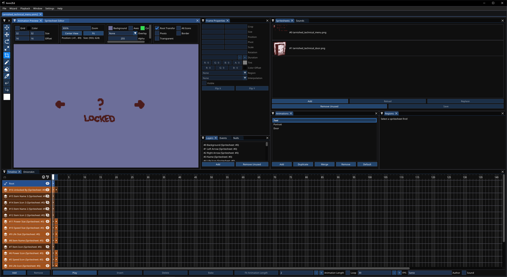
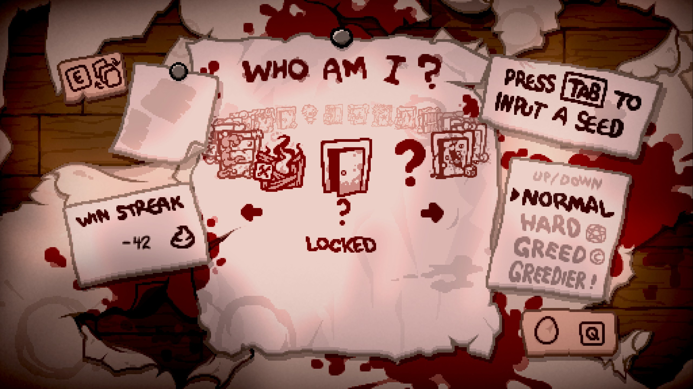
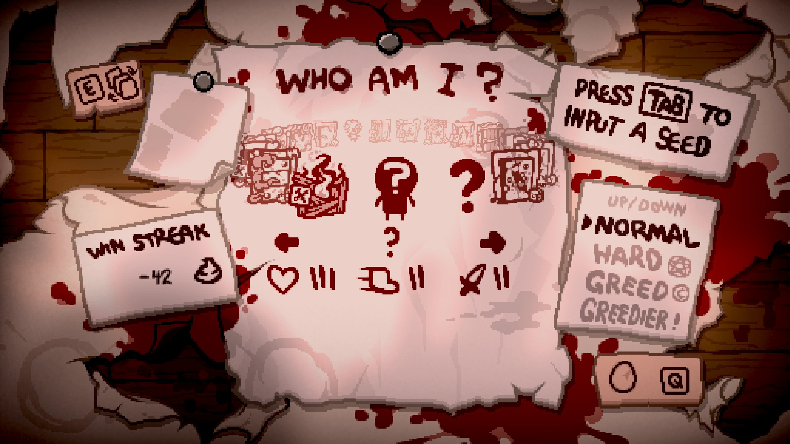

In addition to the work-in-progress set of tarnished characters for the vanilla cast, Epiphany supports adding tarnished versions of modded characters. This guide covers everything you'd need to know about adding and configuring your own tarnished character.

???- info "Converting an old Tarnished"
	Reading this guide to update a custom Tarnished character made before Wave 8? Here's a quickstart list of what to update:

	**Required**:

	- Required achievement in `achievements.xml` named `"HIDE_MENU_[CHAR_NAME]"`, where `[CHAR_NAME]` (without brackets) is the name of your Tarnished entered into the Epiphany API.
	- Use `hideachievement` instead of `hidden` in your `players.xml` for your tarnished, setting it equal to your new HIDE_MENU achievement.
	- New color palette for tarnished characters, and a normal "grey" version of the portrait. The grey one is assigned to your content folder's characterportraits.xml, the red to your tarnished menu anm2.
	- Add `taintedID` to your table in `Epiphany.API.AddCharacter` and set it equal to the tainted character ID that your character should be sorted under.

	**Optional:**

	- Hit sounds, death sounds, starting stats, pocket actives, starting health, and character costume can all be defined in [players.xml](https://repentogon.com/xml/players.html).
	- New attributes to `Epiphany.API.AddCharacter`: `blockedItems`, `blockedTrinkets`, `hairCostumeItems`, `hairCostumeNulls`, `bloodTears`, `nullStats`. See [this section](#registering-the-tarnished) for more information.
	- To ensure your tarnished only applies to Epiphany Wave 8 and up, you can require a version check on top of the global check before you add your tarnished, being: `Epiphany and tonumber(Epiphany.WAVE_NUMBER) >= 8`.

## Setting up your character

This guide assumes you know how to create a modded character to begin with. If for some reason you don't, see [this page on Isaac Blueprints](https://isaacblueprints.com/tutorials/crash_course/character/). Setting up your character entry should be identical to making a normal modded character. For this guide, we will be creating a tarnished version of a character named "?".

Before Wave 8, you could create a tarnished character on its lonesome without the requirement of a normal or tainted version. With the implementation of tarnished characters directly on the main menu, it overrides an existing character on the menu. As such, **you must have at least one other character entry to add a tarnished character**. This may change in the future, but for now you need a character that will show up on the main menu at all times.

### Achievements

Due to how tarnished characters are implemented to be accessible from the main menu, **you must add at least one achievement tied to your character**, regardless of intention. This is so that your character can be hidden from the main menu but accessible in the co-op menu. In most cases, however, you will want to make your tarnished unlockable, and you will require two achievements. For the purposes of the guide, we will be making Tarnished Guppy unlockable.

```xml
<achievements gfxroot="gfx/ui/achievement/">
	<!-- This is what the player will actually see when you unlock the tarnished. -->
	<!-- Epiphany uses `tarnished_achpaper.png` for its achievements. You do not need to make a copy of the image inside your mod to use it. -->
	<achievement name="CHARACTER_?" text='You unlocked "?"' gfx="tarnished_achievement_character_technical.png" gfxback="tarnished_achpaper.png" />
	<!-- The menu achievement must be "HIDE_MENU_" followed by the name of your character entered into the Epiphany API. You must have this achievement for your character whether or not it is unlockable. -->
	<!-- Be sure to add the hidden attribute as this isn't an achievement meant to be seen by the player. -->
	<achievement name="HIDE_MENU_?" hidden="true" />
</achievements>
```

### Character entry

Inside the players.xml, your character will be setup like a regular non-tainted character. Majority of things your character starts out with can be managed here thanks to REPENTOGON, the main highlights being a costume, pocket active, and basic stats. See [here](https://repentogon.com/xml/players.html) for a full list of variables.

Following the pattern of tainteds, you may want to name your tarnished the same as its regular variant. To prevent name clashing, the unicode symbol `U+200B`, or "ZERO WIDTH SPACE", is used as a unique identifier without compromising the name of the character. Add this character to the start of your tarnished's name. It can be copied from [here](https://unicode-explorer.com/c/200B). This is not necessary if your tarnished uses a unique name.

Lastly, preventing your character from showing up on the menu as a regular character entry is done using the `hideachievement` attribute. Assign the HIDE_MENU achievement here.

```xml
<players root="gfx/characters/costumes/" portraitroot="gfx/ui/stage/" nameimageroot="gfx/ui/boss/">
	<player name="?"
		birthright="???" skin="character_technical.png" bonehearts="3" items="249"
		nameimage="playername_technical.png"
		portrait="playerportrait_technical.png"
		skinColor="6"
	/>
	<player name="?" bSkinParent="?"
		birthright="???" skin="character_technical_b.png" soulhearts="6" goldenhearts="3" items="414"
		nameimage="playername_technical.png"
		portrait="playerportrait_technical_b.png"
		skinColor="6"
	/>
	<player name="​?" hideachievement="HIDE_MENU_?"
		birthright="???" skin="character_technical_c.png" hp="6"
		nameimage="playername_technical.png"
		portrait="playerportrait_technical_c.png"
		skinColor="6"
	/>
</players>
```

### Content folder/Menu assets

Inside your mod's content folder, the following anm2s should be used by your tarnished:

- characterportraits.anm2 (For the continue widget; character menu handled separately by Epihany)
- controls.anm2 (Create an animation, but only create a blank frame. Displaying controls for tarnisheds is handled separately by Epiphany)
- coop menu.anm2
- death screen.anm2

charactermenu.anm2 is unused, as Epiphany handles rendering menu contents manually. A separate anm2 is required for this that is added through the Epiphany API, which must have the following animations:

???+ note
	Layers and spritesheets are not relevant to the anm2 setup; just the animations.

- "Portrait": The character's menu portrait while unlocked.
- "Text": The character's menu text. This includes name, arrows, stats, etc. First frame is what will be displayed while the tarnished is locked, second frame while unlocked.
- "Door": The character's menu portrait while locked.



Unlike the vanilla charactermenu.anm2, Epiphany's menu has all sprites pivoted in the center of the animation instead of offset to the bottom right corner. The tarnished menu then applies an offset of X: 239, Y: 141 to place the text in the correct position. If your tarnished's menu text is setup similarly, apply a reverse offset of X: -239, Y: -141 to the animation's root frame.

## Optional additions

Not required by the Epiphany API, this section covers optional additions to your tarnished that warrant more detail.

### Item-specific hair costumes

As of Wave 8, a system was created to allow for custom variants of a tarnished's hair costume depending on the currently active head costume from an item or null item. A lot of automation is in place to handle the majority of work involved, but your tarnished must have the `modcostume` and `costumeSuffix` variables present in their `players.xml`.

???- note "Head costumes only"
	This system only supports items that change the `head` layer, such as Brimstone, Ipecac, etc. An item that doesn't change that layer, such as Sad Onion, will have no effect.

When adding your tarnished through the Epiphany API, it can accept a table map of CollectibleType (or NullItemID) to strings, of which will be the filenames of the associated spritesheet inside your tarnished's costume suffix folder. See below for example:

```Lua
	local hairCostumeItems = {
		--The full filepath would turn out to gfx/characters/costumes_characterSuffixHere/gross_ipecac_hair.png
		[CollectibleType.COLLECTIBLE_IPECAC] = "gross_ipecac_hair.png",
		[COLLECTIBLE_MY_CUSTOM_ITEM] = "super_awesome_hair.png"
	}
	local hairCostumeNulls = {
		[NullItemID.ID_GUPPY] = "furry_guppy_hair.png"
	}
```

### Overriding collectibles and trinkets

REPENTOGON allows the ability to block certain collectibles and trinkets per-player, acting as if they don't have the item at all. This is desireable for tarnisheds that may want to create a unique synergy/interaction without any of the attributes of the item itself.

Epiphany allows you to assign specific collectibles and trinkets to your tarnished that will always be blocked on only that tarnished. It will be unblocked when switching characters. The following functions can be used for convenience:

- Epiphany:HasBlockedCollectible(`EntityPlayer` player, `CollectibleType` item)
- Epiphany:GetBlockedCollectibleNum(`EntityPlayer` player, `CollectibleType` item)
- Epiphany:HasBlockedTrinket(`EntityPlayer` player, `TrinketType` trinket)

## Registering the tarnished

Adding your tarnished to Epiphany's API uses the following function:

```Lua
Epiphany.API.AddCharacter(charInfo: table)
```

???+ info "Required variables"
	`charName`, `charID`, `playerAnm2`, and `menuGraphics` are required variables. `taintedID` is not enforced, but is recommended. All other variables are optional
|Variable Name|Possible Values|Description|
|:--|:--|:--|
|charName|string|The name of your tarnished. **This is used as an important identifier** outside of the tarnished's PlayerType. It must match the name used in the HIDE_MENU and CHARACTER achievement|
|charID|integer|PlayerType of your tarnished using [Isaac.GetPlayerTypeByName](https://wofsauge.github.io/IsaacDocs/rep/Isaac.html#getplayertypebyname)|
|playerAnm2|string|Path to an anm2 file that your tarnished will use in place of the default player anm2. See Epiphany's own player anm2 files in `gfx/characters/` as a reference to copy from|
|taintedID|integer|PlayerType of the associated tainted using [Isaac.GetPlayerTypeByName](https://wofsauge.github.io/IsaacDocs/rep/Isaac.html#getplayertypebyname). **If this variable is not provided**, it will attempt to look for the first available tainted character from your mod. If found, your tarnished will be placed at that tainted's position on the character wheel. If no tainteds can be found, they will not be registered to the tarnished menu|
|menuGraphics|string|File path to the anm2 file that contains menu assets. See [Menu sprites](#content-foldermenu-assets)|
|unlockChecker|function|Doesn't pass any arguments. Return a `boolean` for whether or not the tarnished is unlocked|
|floorTutorial|string|Path to an anm2 file. Must have one animation named "Tutorial" that holds the character tutorial. Unlike vanilla, does not support dynamic input sprites, so it must display keys manually|
|charStats|table|Accepts (bool)`FLYING`, (TearFlags)`TEAR_FLAGS`, (Color)`TEAR_COLOR`, and (Color)`LASER_COLOR` as variables inside the table. More are available, but remain for backwards compatibility pre-Wave 8|
|nullStats|integer|ID for a null item obtained with [Isaac.GetNullItemIdByName](https://repentogon.com/Isaac.html#getnullitemidbyname). Use for applying flat/multiplicative tears/damage to your tarnished|
|bloodTears|boolean|Set to `true` to have your tarnished shoot blood variants of tears|
|hairCostumeItems|table|Map of CollectibleType to string containing a png filename. See [Item-specific hair costumes](#item-specific-hair-costumes)|
|hairCostumeNulls|table|Map of NullItemID to string containing a png filename. See [Item-specific hair costumes](#item-specific-hair-costumes)|
|blockedItems|table|Array of CollectibleType that will be blocked for the tarnished, acting as if they don't have the item. See [Overriding collectibles and trinkets](#overriding-collectibles-and-trinkets)|
|blockedTrinkets|table|Array of TrinketType that will be blocked for the tarnished, acting as if they don't have the item. See [Overriding collectibles and trinkets](#overriding-collectibles-and-trinkets)|

**Adding your tarnished must be done under a specific callback** in order appear on the menu properly: [MC_POST_MODS_LOADED](https://repentogon.com/enums/ModCallbacks.html#mc_post_mods_loaded). REPENTOGON introduced this callback as a reliable way of applying patches for other mods without requiring a run be started. This is required here, since your character will be present on the menu before you start a run.

See below for an example of how the patch would be applied:

```Lua
---@class ModReference
local Mod = RegisterMod("Tarnished Example", 1)

--Your mod requires REPENTOGON. Stop errors from happening if the user doesn't have it installed.
if not REPENTOGON then
	return
end

local PLAYER_TECHNICAL_B = Isaac.GetPlayerTypeByName("?", true)
local PLAYER_TECHNICAL_C = Isaac.GetPlayerTypeByName("​?")
local persistGameData = Isaac.GetPersistentGameData()
local ACH_TARNISHED_TECHNICAL = Isaac.GetAchievementIdByName("CHARACTER_?")

Mod:AddCallback(ModCallbacks.MC_POST_MODS_LOADED, function ()
	--You should always check for not just the Epiphany global, but that it's also on the correct version.
	--This is because the legacy version of Epiphany is a separate upload on the workshop, the last wave available there being 7.5.
	--Only apply the patch for Wave 8 or above so that you know you're working with the REPENTOGON-exclusive version of Epiphany.
	if Epiphany and tonumber(Epiphany.WAVE_NUMBER) >= 8 then
		Epiphany.API.AddCharacter({
			charName = "?",
			charID = PLAYER_TECHNICAL_C,
			playerAnm2 = "gfx/tarnished_technical.anm2",
			menuGraphics = "gfx/ui/main menu/tarnished_technical_menu.anm2",
			taintedID = PLAYER_TECHNICAL_B,
			unlockChecker = function ()
				return persistGameData:Unlocked(ACH_TARNISHED_TECHNICAL)
			end,
			floorTutorial = "gfx/tarnished_technical_controls.anm2",
			bloodTears = true
		})
	end
end)
```

After the patch is applied, you should see your tarnished character available through the tarnished menu!





## Mod Download

This example character is available as a downloadable mod, complete with a regular, tainted, and tarnished character.

You can download the mod from [this GitHub repository](https://github.com/BenevolusGoat/tarnished_example)