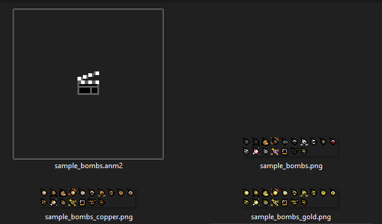

Sample bombs are a new pickup type introduced in Wave 8. They're both a bomb and a bomb synergy in one, where the bomb synergy is limited in use, expending one each time you place down a bomb. If your mod adds a new bomb synergy, this guide goes over how to add your bombs as an eligible sample bomb.

???+ note "Collectibles only"
	Sample bombs work exclusively off of adding innate collectibles. If your bomb synergy is done through any other non-collectible means but still want to add a sample bomb version, consider making a hidden collectible to use instead.

???- info "Existing mod support"
	Epiphany already supports a number of mods that add their own bomb synergies. This currently includes:

	- [Edith Restored](https://steamcommunity.com/sharedfiles/filedetails/?id=3552120418) (Thunder, Shrapnel)
	- [Fiend Folio](https://steamcommunity.com/sharedfiles/filedetails/?id=3778123093) (Nugget, Musca, Bridge)
	- [Restored Collection](https://steamcommunity.com/sharedfiles/filedetails/?id=3246021872) (Blank, Dice, Safety, Stone)
	- [Sheriff](https://steamcommunity.com/sharedfiles/filedetails/?id=3082060097) (Armed)


## HUD icon

There are two things required for adding a sample bomb:

1. The bomb anm2 itself, which you should already have anyways
2. An anm2 for rendering a miniature bomb icon on the HUD, paired with three different spritesheets

Whenever you collect a sample bomb, the last one you collected is displayed over the bomb HUD icon. You need to register an anm2 to serve as your mod's set of bomb HUD sprites and define which frame belongs to which bomb synergy. It only needs one animation.

For the three spritesheets, the bombs can appear in three states: normal, golden, and copper. Whatever you name your spritesheet, you must have `_gold` and `_copper` suffixed to it. Gold bombs obviously come from vanilla's gold bombs, while copper bombs are a unique mod compatibility with Fiend Folio's copper bombs. The gold and copper spritesheets will automatically be swapped out with the default one set in your anm2, so no extra action is needed there.



### Adding the HUD anm2

Adding your anm2 is done with the following function:

```Lua
Epiphany.API:AddBombHUDSprite(id: string, sprite: Sprite)
```

- `id`: The string to associate with the Sprite object you pass into the function, which is what your mod's bombs will use to render
- `sprite`: The Sprite object you load your anm2 into. Don't need to do anything other than loading it and its graphics.

### Dynamic Bomb HUD

Whenever [Dynamic Bomb HUD](https://steamcommunity.com/sharedfiles/filedetails/?id=3406985235) is enabled, the sample bomb HUD rendering done by Epiphany is disabled. Compatibility for this mod is important for Epiphany since both mods share developers and sprites.

You will need three different anm2s for normal, gold, and copper bombs, pointed to the appropriate spritesheet. For adding support through Lua, you can copy and modify the following Lua snippet below:

```Lua
local BOMB_ITEM = Isaac.GetItemIdByName("My Bomb Item")

if CustomBombHUDIcons and Epiphany and tonumber(Epiphany.WAVE_NUMBER) >= 8 then
	--Or AddPriorityBombIcon, where you pass CustomBombHUDIcons.BombPriority.[IMPORTANT/EARLY/DEFAULT/LATE] first, then the table
	CustomBombHUDIcons:AddBombIcon({
			Name = 'My Bomb Item',
			--These of course can be placed anywhere, these are just examples
			Anm2 = "gfx/ui/my_bomb_icons.anm2",
			GoldAnm2 = "gfx/ui/my_bomb_icons_golden.anm2",
			CopperAnm2 = "gfx/ui/my_bomb_icons_copper.anm2",
			FrameName = "AnimationGoesHere",
			Frame = 0,

			Condition = function(player)
				return player:HasCollectible(BOMB_ITEM)
					--Will check if you have any amount of sample bombs of specifically your bomb item
					or Epiphany:HasBombSample(BOMB_ITEM)
			end
		}
	)
end
```

## Adding the bomb

Adding your bomb is done with the following function:

```Lua
Epiphany.API:AddBombToSampleBombs(type: CollectibleType, body: string, hudSpriteID: string, hudFrame: integer)
```

- `type`: The CollectibleType of your bomb synergy.
- `body`: The anm2 of the bomb itself. Needs to have Appear and Idle animations at minimum.
- `hudSpriteID`: The ID you passed earlier into `AddBombHUDSprite`.
- `hudFrame`: Which frame in the anm2 belongs to the bomb synergy.

???+ note "hudSpriteID"
	Be sure not to use "Vanilla" or "Modded" for the ID, as these are used exclusively by Epiphany. Epiphany already adds support for a number of bomb synergies in various mods, seen at the top of this page.

As a bonus for adding your bomb synergy as a sample bomb, it will also go towards the unlock condition for Bomb Sack, which in of itself unlocks sample bombs!

## Spawning your sample bomb

The unique setup of sample bombs has it so there is only a single bomb pickup entity involved. If you want to spawn a specific bomb such as your own for testing, do the following:

1. Set Epiphany.FLAGS.Debug to `true` in the `flags.lua` file at the root of Epiphany's mod folder. It unlocks debug commands that are only registered on mod load.
2. Use the debug command `epiphany_debug spawnsamplebomb` followed by the item ID of the bomb synergy you wish to spawn.